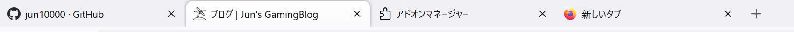

# タブ外観変更用userChrome.css

*Vista by Daemondevir*

*Light*

*Dark*

## セットアップ
1. "about:config"を開く
1. "toolkit.legacyUserProfileCustomizations.stylesheets"の値を"true"に変更
1. "about:support"を開く
1. "アプリケーション基本情報 > プロファイルフォルダー > フォルダーを開く"を実行する
1. 表示されたフォルダに、付属している"chrome"フォルダを丸ごとコピーする
1. "about:support"に戻り、"起動時キャッシュを消去..."を実行する
